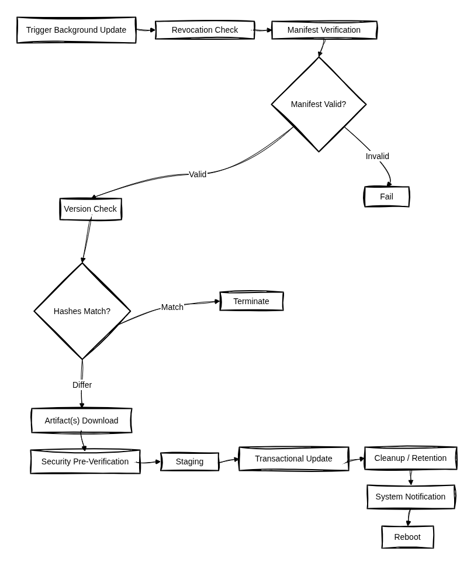
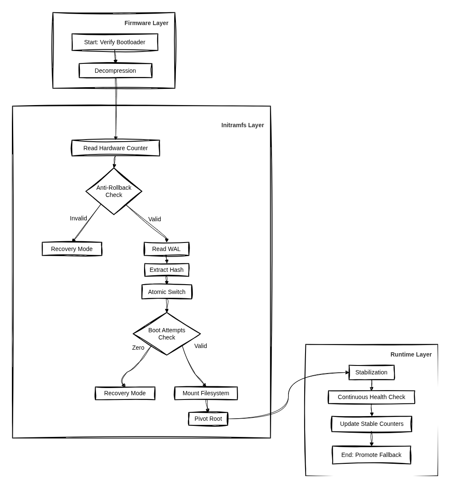

<p align="center">
  
</p>

<h1 align="center">Atom Loops</h1>

<p align="center">
  Atomic and reproducible operating-system deployment for embedded and desktop Linux.
</p>

---

Atom Loops is an open source system for atomic and reproducible deployment of the
operating system on embedded and desktop Linux devices. An update is one
transaction: download, verify, switch, with automatic rollback on boot failure.

It is not a Linux distribution and not a package manager. It consumes a finished
system image and owns only the deploy and rollback lifecycle. It needs no
container engine, no registry, and no dedicated partition layout beyond an ESP.

## How it works

A background daemon prepares the update while the system runs: it checks the
revocation list, verifies the signed manifest, downloads only what changed,
re-verifies the artifacts and stages them. Nothing is switched yet.

<p align="center">
  
</p>

The switch happens at the next boot, and the boot decides whether it holds. The
initramfs checks the anti-rollback counter, reads the write-ahead log, sets up
dm-verity and swaps the slots; if the attempt counter runs out the device falls
back or enters recovery. Only after enough good boots is the new image promoted.

<p align="center">
  
</p>

## Status

Under active development, not ready for production.

The first integration target is [Sinty OS](https://github.com/singularityos-lab),
which is where the code is currently exercised end to end. Only x86_64 (UEFI) is
validated so far. The roadmap below states what is implemented and what is not.

The proof of concept this project grew from is kept at the
[`poc`](https://github.com/mirkobrombin/AtomLoops/tree/poc) tag: loopback boot of
a distribution image, plus mocks for the build and deploy infrastructure.

## Roadmap

| Milestone | Scope | Status |
| --- | --- | --- |
| M1 | Core engine: initramfs, WAL, atomic switch, dm-verity | Largely done |
| M2 | OTA daemon: download, cryptographic verification, deploy | Partial. Manifest verification, revocation and staging work. Zsync delta download is not implemented, artifacts download in full |
| M3 | Secure Boot and kernelcache: UKI and FIT | Partial. UKI only. FIT/U-Boot and `atom-enroll` not started |
| M4 | Hardware anti-rollback: TPM 2.0 and RPMB | Partial. Not validated against TPM or RPMB hardware |
| M5 | Recovery mode | Partial. The recovery agent lives in its own repository. The independent recovery image is not proven |
| M6 | Testing across the target hardware fleet | Not started. x86_64 only |
| M7 | CLI, documentation and public release | Partial. Release runbook only. No integration guide, no reproducible build environment |

## Requirements

- Go >= 1.22 (daemon + release tools)
- Zig 0.16 (the UEFI loader, `loader/`)

## Build

```bash
go build ./...             # atomd (daemon) + atom-sign (release tool)
cd loader && sh build.sh   # BOOTX64.EFI (needs zig 0.16)
```

## Components

- `internal/deployment` - the deployment.json WAL (single source of truth).
- `internal/otad` + `cmd/atomd` - the daemon: boot confirmation, staging,
  anti-rollback, recovery.
- `internal/trust` + `internal/signing` + `cmd/atom-sign` - the two-level key
  chain (root cert, signing key, manifest) and the release tooling.
- `scripts/boot/initramfs-main.go` - the early-boot engine: dm-verity setup and
  the atomic switch before switch_root.
- `loader/` - the Zig UEFI loader: boot-slot selection and signature
  verification before chainloading the kernelcache.

## Security model

Two-level keys: a cold ROOT key signs a short-lived signing certificate and a
revocation list; the operational SIGNING key signs update manifests. The daemon
checks revocation first, then the cert against the root, then the manifest
against the signing key, then the artifacts by SHA256. See
[docs/RELEASE-RUNBOOK.md](docs/RELEASE-RUNBOOK.md).

## License

GPL-3.0 - see [LICENSE](LICENSE).
